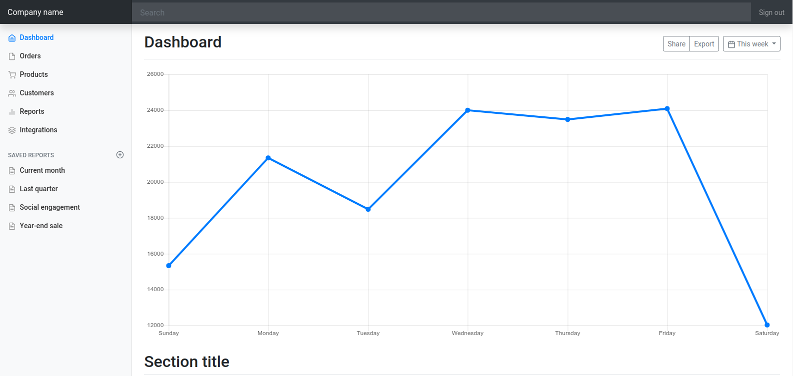

## Projeto de Dashboard

Usando o exemplo [dashboard bootstrap 4.3](https://getbootstrap.com/docs/4.3/examples/dashboard/) e a estrutura do [laravel](https://laravel.com/)  esta dashboard esta pronta para ser usada nos seus projetos basta clonar o repositório e usar

```$xslt
git clone https://github.com/jos3duardo/dashboard-bootstrap-laravel
```



